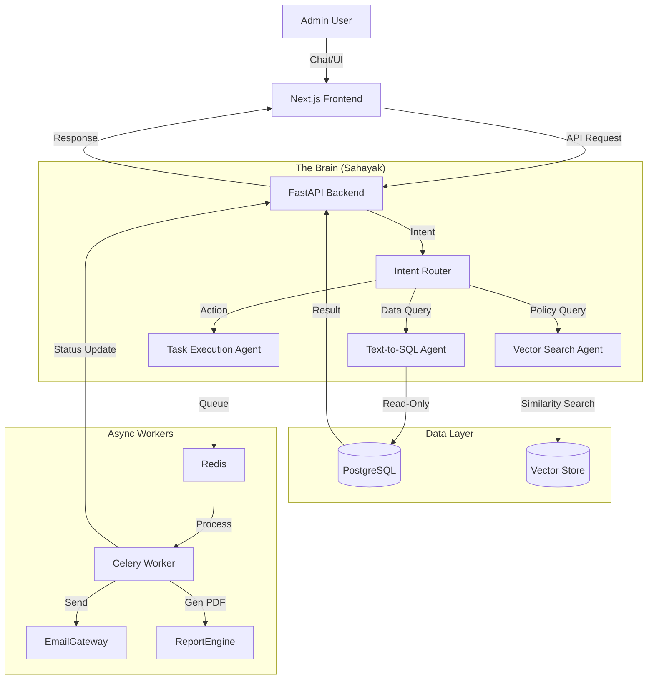

# Learnivo AI: Institutional Operating System (IOS) Architecture & Strategy
> **Tagline**: The Evolution of Educational Intelligence.

## Executive Summary
Learnivo AI is evolving from a dashboard into a proactive **Institutional Operating System (IOS)**. Unlike passive ERPs that store data, Learnivo IOS uses **Agentic AI** to actively manage operations, optimize academic performance, and assist administrators via a unified natural language interface ("Sahayak").

---

## SECTION 1: CORE MANAGEMENT LAYER (The Foundation)
*Reliable, robust, and relational. This layer manages the "State of Truth" for the institution.*

### 1.1 Core Modules
| Module | Features | Data Entities |
| :--- | :--- | :--- |
| **Admissions** | Lead CRM, Online Application Forms, Merit List Generation, Document Verification workflows. | `Leads`, `Applications`, `Documents`, `AdmissionStatus` |
| **Fee Command** | Invoice Generation, Payment Gateway Integration, Partial Payment Tracking, Defaulter Alerts, Receipt Generation. | `FeeStructures`, `Invoices`, `Transactions`, `FeeWaivers` |
| **Academic Registry** | Batch/Class management, Subject mapping, Timetable generation, Faculty allocation. | `Batches`, `Subjects`, `TimeTable`, `FacultyAllocation` |
| **Attendance** | Biometric integration / Digital Roll-call, Leave Management, Holiday Calendar. | `AttendanceRecords`, `Leaves`, `Holidays` |
| **Examination** | Exam scheduling, Hall ticket generation, Marks entry, Report card generation (GPA/CGPA/Percentage). | `ExamSchedules`, `Marks`, `ReportCards`, `GradeScales` |
| **Communication** | SMS/Email/WhatsApp notifications engine, Notice board. | `Notifications`, `Templates`, `SentLogs` |
| **HR & Payroll** | Staff directory, Payroll processing, Leave tracking. | `Staff`, `Payroll`, `Leaves` |

### 1.2 Access Control & Workflows
**RBAC System (Role-Based Access Control):**
*   **Super Admin**: Full schema access. Configures global settings.
*   **Principal/Dean**: View-all access, approval authority for critical actions (fee waivers, expulsions).
*   **Accountant**: R/W access to Fees, Expenses, Payroll. Read-only for Students.
*   **Teacher**: R/W access to Attendance, Marks, Homework. Read-only for Student Basic Info.
*   **Student/Parent**: Read-only personal dashboard. Write access for assignments/applications.

---

## SECTION 2: AI-POWERED INTELLIGENCE LAYER
*The differentiation layer. Turns static data into actionable insights.*

### 2.1 AI Modules
#### A. Student Success Engine
*   **Dropout Risk Predictor**:
    *   **Input**: Attendance < 75%, Late Fees > 2 months, Falling Grades in 2 consecutive tests.
    *   **Output**: High/Medium/Low risk score with specific "Why?" reasoning.
    *   **Action**: Auto-drafts intervention email for the counselor.
*   **Performance Holistics**:
    *   **Input**: Exam marks, assignment completion rates, class participation (teacher logged).
    *   **Output**: Generated textual progress reports (e.g., "Arjun is excellent in Math but struggles with Physics concepts related to Thermodynamics").

#### B. Administrative Efficiency
*   **Fee Defaulter Pattern Analysis**:
    *   **Input**: Historical payment dates.
    *   **Output**: Prediction of cash flow for next month. Identifies "Habitual Late Payers" vs "One-time Crisis".
*   **AI Timetable Optimizer**:
    *   **Constraint Solver**: Ensures no teacher overlap, balances heavy subjects (Math/Science) with lighter ones (Arts/PE), optimizes room usage.

#### C. Smart Communication
*   **Inquiry Response Bot**:
    *   **Mechanism**: RAG (Retrieval Augmented Generation) on School Policy PDF + Fee Structure.
    *   **Function**: Auto-replies to prospective parent emails/chats.
*   **AI Notice Drafter**:
    *   **Input**: "Draft a notice for a Diwali holiday on 24th Oct."
    *   **Output**: Formal, formatted notice ready for broadcast.

---

## SECTION 3: "SAHAYAK" - THE ADMIN AI AGENT
*The central interface for the IOS. A Text-to-Action engine.*

### 3.1 Capabilities & Interaction
**Multi-Modal Interaction**:
1.  **Natural Language Querying (NLQ)**: "Show me pending fees for Class 10-A."
2.  **Action Execution**: "Send a reminder to all these parents."
3.  **Report Generation**: "Create a PDF summary of attendance for this week."

### 3.2 Technical Architecture of Sahayak
*   **Intent Classifier**: Distinguishes between:
    *   *Database Query* ("How many students?")
    *   *Document Query* ("What is the leave policy?")
    *   *Action Request* ("Send email...")
    *   *Analysis Request* ("Why is revenue down?")
*   **Text-to-SQL Engine**:
    *   Converts "students with >3 absences" -> `SELECT * FROM students WHERE absences > 3`.
    *   **Safety Layer**: Read-only permissions ensures Sahayak never accidentally deletes data via SQL injection.
*   **RAG Engine**:
    *   Indexes School Handbooks/Policies.
    *   Retrieves relevant context for policy questions.

### 3.3 Hallucination Prevention & Security
*   **Constrained Output**: Sahayak does not "guess". If SQL returns NULL, it says "No records found."
*   **Human-in-the-Loop (HITL)**: All *Write* actions (Sending emails, Approving leave, Generating Invoices) require a "Confirm" button click from the Admin.
*   **Audit Logs**: Every query and every action taken by Sahayak is logged (`sahayak_logs`) for accountability.

---

## SECTION 4: SYSTEM ARCHITECTURE
*Built for scale, security, and speed.*

### 4.1 Technology Stack
*   **Frontend**: Next.js 14 (App Router) + Tailwind CSS + Framer Motion (The Interface).
*   **Backend API**: Python FastAPI (High performance, native AI support).
*   **Database**: PostgreSQL (Structured Data) + pgvector (Vector Embeddings for RAG).
*   **Task Queue**: Celery + Redis (For generating reports, sending bulk emails, running AI models).
*   **AI Orchestration**: LangChain / LlamaIndex.

### 4.2 Data Flow Architecture

---

## SECTION 5: COMPETITIVE STANDOUT FACTORS

| Feature | Generic ERP / LMS | **Learnivo IOS** |
| :--- | :--- | :--- |
| **Interface** | Cluttered Menus, 100+ clicks/day | **Conversational (Sahayak)**, 10 clicks/day |
| **Data Usage** | Passive Storage (Digital Filing Cabinet) | **Active Intelligence** (Predicts dropouts, cash flow) |
| **Customization**| Rigid Hardcoded Modules | **Dynamic & Modular** (AI adapts to school specific terms) |
| **Reports** | Generic CSV Exports | **Narrative AI Reports** ("Principal's Morning Briefing") |
| **Focus** | "Management" (Data Entry) | **"Execution"** (Getting things done) |

**Key Differentiator: "The Monday Morning Briefing"**
Instead of the Principal logging in to check 10 charts, Sahayak sends a WhatsApp/Email summary at 8 AM:
> *"Good Morning. Attendance is 94%. 3 Teachers are on leave (Substitutions arranged). Monthly fee collection is at 60% (predicted to reach 95% by Friday). Here are 5 students requiring attention today."*

---

## SECTION 6: MONETIZATION & PRICING
*SaaS B2B Model with Upsell levers.*

### 6.1 Pricing Tiers

**tier 1: FOUNDATION (Small Institutes / Coaching)**
*   **Price**: ₹4,999/month (billed annually) or ₹20/student/month.
*   **Features**: Admission, Fees, Attendance, Basic Reports.
*   **AI**: None.

**tier 2: GROWTH (K-12 Schools / Colleges)**
*   **Price**: ₹14,999/month or ₹50/student/month.
*   **Features**: Full ERP, Parent App, Exam Management.
*   **AI**: Basic Sahayak (Query Data only), Smart Reports.

**tier 3: INTELLIGENCE (Enterprise / Chains)**
*   **Price**: Custom (approx ₹100/student/month).
*   **Features**: Multi-branch management, API Access, Whitelabeling.
*   **AI**: Full Sahayak (Actions enabled), Predictive Analytics, Custom Model Fine-tuning.

### 6.2 Add-Ons (High Margin)
*   **Usage-Based**: WhatsApp Credits, SMS Credits.
*   **Hardware**: Biometric Devices / Smart ID Cards (One-time cost).

---

## SECTION 7: 12-MONTH EXECUTION ROADMAP

**Q1: The Foundation (Months 1-3)**
*   Finalize PostgreSQL Schema for core ERP.
*   Build granular RBAC (Role Based Access) in FastAPI.
*   Launch "Foundation" modules: Fees, Admission, Student Profile.
*   *Milestone*: Onboard 5 Beta Schools.

**Q2: The Assistant (Months 4-6)**
*   Integrate "Sahayak" Chat Interface in Dashboard.
*   Build Text-to-SQL layer for basic queries ("Show me defaulters").
*   Implement RAG for "School Policies".
*   *Milestone*: Reduce Admin click-time by 40%.

**Q3: The Intelligence (Months 7-9)**
*   Train predictive models on collected data (Dropout/Fees).
*   Launch "Monday Morning Briefing" feature.
*   Enable "Action Mode" for Sahayak (Drafting emails, approving requests).
*   *Milestone*: Commercial Launch of Tier 2 & 3.

**Q4: Scale & Ecosystem (Months 10-12)**
*   Mobile App for Parents & Teachers (Flutter/React Native).
*   API Marketplace for 3rd party integrations (Library hardware, GPS buses).
*   Multi-tenant architecture optimization for scale.
